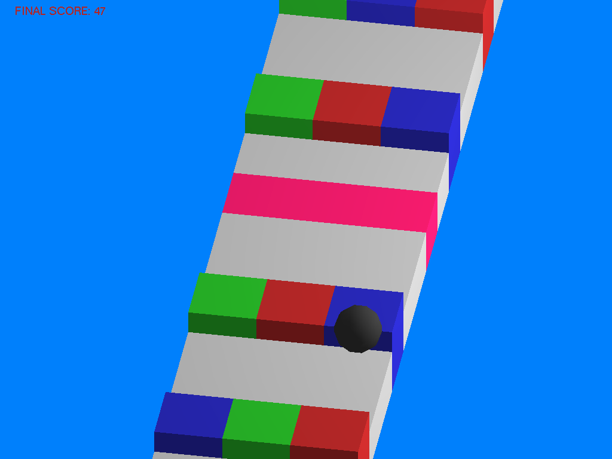
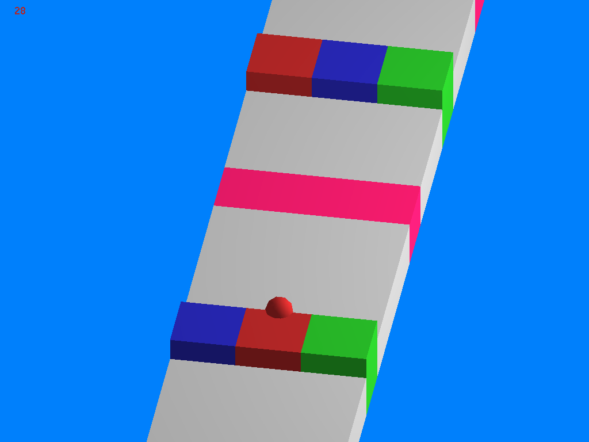
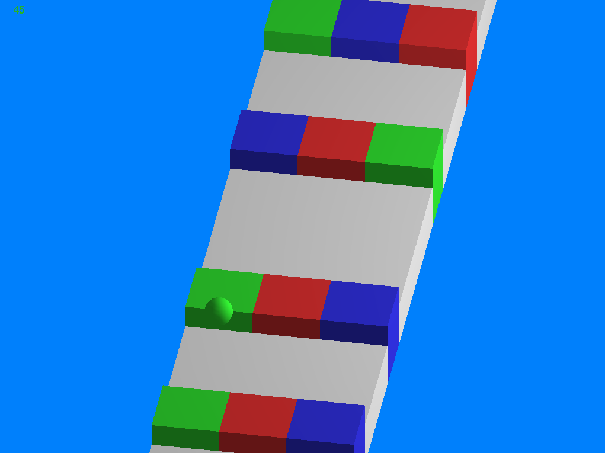

# Colorunner

Colorunner je jednostavna igrica napravljena koristeci OpenGl biblioteku, za potrebe kursa Racunarska Grafika na Matematickom fakultetu, 2018 godine.

## Kratka pravila

Igrac kontrolise lopticu koja se krece stazom. Loptica se moze kretati levo ili desno. Loptica moze biti odredjene boje
(crvena, zelena ili plava), i kada se pojave obojene prepreke loptica moze proci samo kroz prepreku koja je iste boje.
Takodje, moze se pojaviti i roze polje, i loptica ce promeniti boju i nastaviti da se krece normalno kada predje preko njega. 
Cilj igre je da igrac sto duze uspesno kontrolise lopticu i pazi da ne padne sa platforme ili prodje kroz prepreku pogresne boje.

### Kontrole

 * Strelica levo - Kretanje loptice levo.
 * Strelica desno - Kretanje loptice desno.
 * 'P' ili 'p' - Pauza/Izlazak iz pauze.
 * 'Q' ili 'q' - Izlazak iz igre.

## Instalacija i pokretanje igre

Instalacija i pokretanje igre su prilicno jednostavni. Potrebno je otvoriti terminal, pozicionirati se na datoteku sa fajlovima i uneti komandu:

```
make
```

Nakon toga, igra se startuje komandom: 

```
./colorunner
```

## Nekoliko slika iz same igre

Loptica je prosla kroz prepreku drugacije boje - Kraj igre


Loptica je prosla kroz prepreku iste broje i nastavlja dalje. Nakon toga ce stati na roze polje, sto ce izmeniti njenu boju.


Loptica se krece uspesno.

